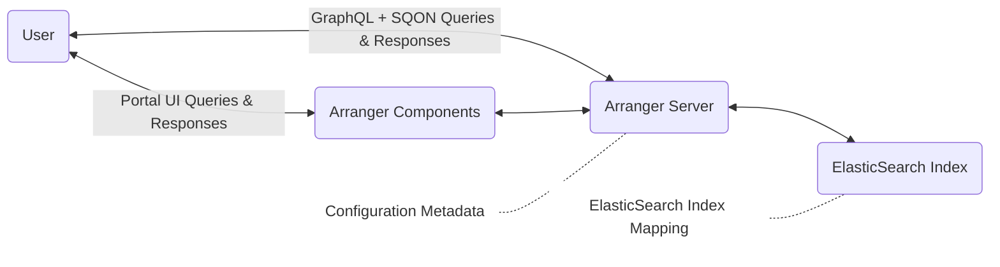

# Arranger

Arranger is a data-agnostic search API that utilizes <a href="https://www.elastic.co/guide/en/elasticsearch/reference/6.4/mapping.html" target="_blank" rel="noopener noreferrer">Elasticsearch index mappings</a> to generate interactive and configurable search components.

## Key Features 

- **Configurable Search UI:** Arranger provides a customizable search interface based on Elasticsearch index mappings, including interactive components like faceted search, data tables, and SQON viewers. These components are customizable without extensive manual coding.

- **GraphQL API:** On the back-end Arranger generates a GraphQL-based API from Elasticsearch mappings, enabling efficient and customizable data retrieval that adapts to your data structure. This API Integrates with our filter notation, SQON, for human-readable and machine-processable search queries

## System Architecture

Arranger integrates with your underlying Elasticsearch cluster to automatically generate a powerful search API based on your configured index mapping. It consists of two main modules, **Arranger Server** and **Arranger Components**.



**Arranger Server** is a GraphQL API that communicates with an Elasticsearch index. One unique feature of Arranger Server is its use of a consistent and custom filter notation called <a href="./reference/sqon/" target="_blank" rel="noopener noreferrer">SQON</a>. SQON is designed to be user-friendly, allowing humans to easily understand and create custom filters while also being straightforward for software systems to interpret and process.

**Arranger Components** are interactive and configurable UI components specifically designed to display and query complex datasets. The example below showcases the Arranger Components that form the foundation of the VirusSeq data portal.


- The left hand box (in red) is Arranger's **faceted search** component
- The bottom box (in blue) is Arranger's **Data Table** component
- The top box (in yellow) is Arranger's **SQON Viewer** component

## Repository Structure


```
.
├── /docker/
│   ├── /elasticsearch
│   ├── /server
│   ├── /test
│   └── /ui
├── /integration-tests
├── /modules/
│   ├── /admin-ui
│   ├── /components
│   └── /server
└── /scripts
```

### docker

Contains Docker-related files for various components of the system, including Elasticsearch, server, test environment, and UI.

### modules

Houses the core modules of the Arranger system:

- **admin-ui:** Likely contains the administration interface for managing Arranger configurations.
- **components:** Includes the Arranger Components for building the search UI.
- **server:** Contains the Arranger Server implementation, which provides the GraphQL API.

### integration-tests

Holds integration tests to ensure different components of the system work together correctly.

### scripts

Contains utility scripts for development, deployment, or other system management tasks.

## Integrations

- We recommend using [Stage](https://www.overture.bio/documentation/stage/), an extensible React-based portal UI specifically designed to house Arrangers search UI components. Stage offers themeable web components including navigation menus, a login UI, profile page, and footer.
