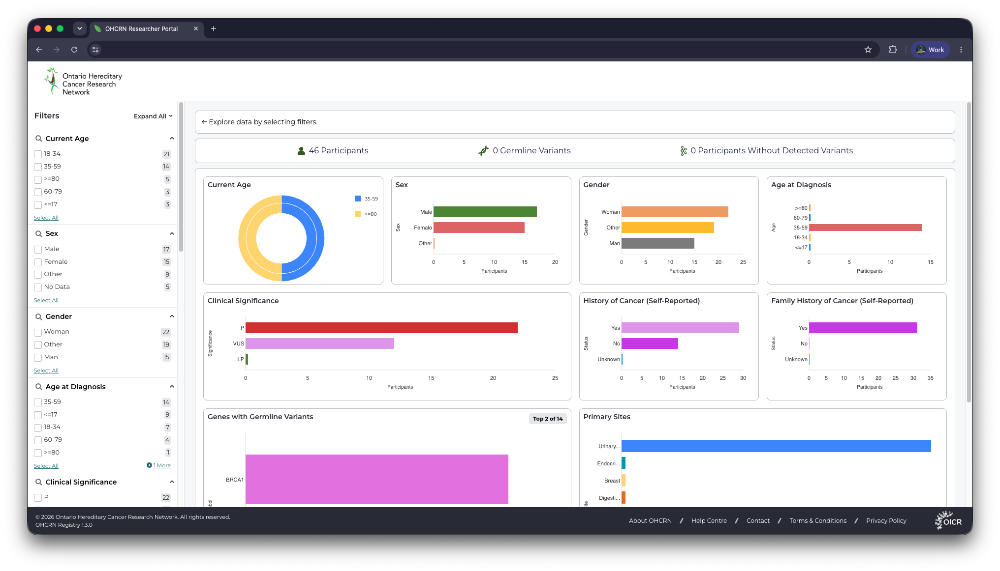

# Overview

**Arranger Charts** is a plugin for Arranger UIs for adding interactive aggregated data charts to React applications. It currently supports Bar and Sunburst charts. Arranger Charts also uses a React context provider to request data from Arranger Server for all charts on the page. Interacting with the charts can update the filters for data requested from Arranger Server.

## Key Features

- Leverages the [Nivo charts](https://github.com/plouc/nivo) library.
- Integrates with Arranger theming for configuring colour schemes.
- **ChartsProvider:** React context provider that requests all the data for all charts inside the provider.
- **Bar chart:** Responsive, horizontal bar chart with configurable colours, tooltips, and sorting.
- **Sunburst chart:** Responsive sunburst chart showing relationships between broad and specific categories.

## Note About Arranger 3.1 and Multiple Catalogues/Indices

Although Arranger 3.1 has been updated to support multiple catalogues (that is, Elasticsearch indices), currently the Arranger Charts library does not support this.

Arranger Charts will only support one index/catalogue, with the document type `file`.

[Arranger Charts issue for allowing multiple indices](https://github.com/overture-stack/arranger/issues/1084)

## Dashboard Example

