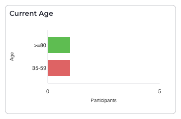
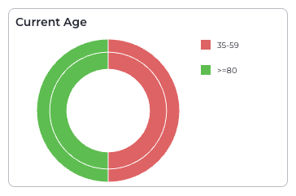

# Usage

This guide covers how to use Arranger Charts, what components are available, and React props for each component.

## Components

### ChartsProvider

The main provider that manages chart registration and data fetching, and coordinates multiple charts.

#### Props

| Name                    | Type      | Required | Description                            |
| ----------------------- | --------- | -------- | -------------------------------------- |
| `debugMode`             | `boolean` | No       | Enable verbose logging for development |
| `disableIncludeMissing` | `boolean` | No       | Hide properties with "No Data"         |
| `loadingDelay`          | `number`  | No       | Delay network results by milliseconds  |

#### Example

```jsx
<ChartsProvider
	debugMode
	disableIncludeMissing={false}
	loadingDelay={250}
>
	{/* ChartsThemeProvider */}
</ChartsProvider>
```

### ChartsThemeProvider

Provides theme configuration and custom components to all child charts. You can nest multiple `<ChartsThemeProvider>` components under a single `<ChartsProvider>`.

#### Props

| Name                   | Type             | Required | Description                           |
| ---------------------- | ---------------- | -------- | ------------------------------------- |
| `colors`               | `string[]`       | No       | Array of hex colors for chart theming |
| `components`           | `object`         | No       | Custom fallback components            |
| `components.EmptyData` | `ReactComponent` | No       | Custom empty state component          |
| `components.ErrorData` | `ReactComponent` | No       | Custom error component                |
| `components.Loader`    | `ReactComponent` | No       | Custom loading component              |

#### Example

```jsx
<ChartsThemeProvider
	colors={['#ff6b6b', '#4ecdc4', '#45b7d1']}
	components={{
		EmptyData: NoDataMessage,
		ErrorData: CustomError,
		Loader: CustomSpinner,
	}}
>
	{/* Charts */}
</ChartsThemeProvider>
```

### BarChart

Renders a horizontal bar chart for aggregation data.

#### Props

| Name                  | Type       | Required | Description                                                                                         |
| --------------------- | ---------- | -------- | --------------------------------------------------------------------------------------------------- |
| `disableTopBarsCount` | `boolean`  | No       | Disables the "Top `bars` of `totalBars`" flag at the top right of charts.                           |
| `fieldName`           | `string`   | Yes      | GraphQL field name to visualize                                                                     |
| `handlers`            | `object`   | No       | Event handlers                                                                                      |
| `handlers.onClick`    | `function` | No       | Callback when clicking a bar segment                                                                |
| `maxBars`             | `number`   | Yes      | Maximum number of bars to display                                                                   |
| `ranges`              | `Range[]`  | No       | For numeric fields, specify value ranges. A `Range` is `{ key: string, from: number, to: number }`. |
| `theme`               | `object`   | Yes      | Chart configuration options                                                                         |
| `theme.sortByKey`     | `string[]` | No       | Array of keys to sort the data by.                                                                  |

#### Example

```jsx
<ArrangerDataProvider
	apiUrl={YOUR_ARRANGER_API_URL}
	documentType="file" // must be "file" for Arranger Charts
>
	<ChartsProvider>
		<ChartsThemeProvider>
			<BarChart
				fieldName="primary_site"
				handlers={{
					onClick: (data) => {
						console.log('Clicked', data.label, data.value);
					},
				}}
				maxBars={15}
				theme={{
					sortByKey: ['Brain', 'Lung', 'Breast', '__missing__'],
				}}
			/>
		</ChartsThemeProvider>
	</ChartsProvider>
</ArrangerDataProvider>
```

#### Screenshot



### SunburstChart

Creates a sunburst chart showing relationships between broad and specific categories.

#### Props

| Name               | Type       | Required | Description                                     |
| ------------------ | ---------- | -------- | ----------------------------------------------- |
| `fieldName`        | `string`   | Yes      | GraphQL field name to visualize                 |
| `maxSegments`      | `number`   | Yes      | Maximum number of segments to display           |
| `mapper`           | `function` | Yes      | Maps outer ring values to inner ring categories |
| `handlers`         | `object`   | No       | Event handlers                                  |
| `handlers.onClick` | `function` | No       | Callback when clicking a segment                |
| `theme`            | `object`   | No       | Chart configuration options                     |

#### Example

```jsx
<ArrangerDataProvider
	apiUrl={YOUR_ARRANGER_API_URL}
	documentType="file" // must be "file" for Arranger Charts
>
	<ChartsProvider>
		<ChartsThemeProvider>
			<SunburstChart
				fieldName="primary_diagnosis"
				maxSegments={12}
				mapper={(value) => {
					if (value.startsWith('C78')) return 'Metastatic';
					if (value.startsWith('C50')) return 'Breast Cancer';
					return value;
				}}
				handlers={{
					onClick: (data) => {
						console.log('Selected category:', data);
					},
				}}
			/>
		</ChartsThemeProvider>
	</ChartsProvider>
</ArrangerDataProvider>
```

#### Screenshot



## Field Types

Charts automatically detect field types from Arranger's extended mapping:

- **Aggregations**: Categorical fields
- **NumericAggregations**: Numeric fields that require range specifications

For numeric fields, provide ranges:

```jsx
<BarChart
	fieldName="age_at_diagnosis"
	ranges={[
		{ key: '0-18', from: 0, to: 18 },
		{ key: '19-65', from: 19, to: 65 },
		{ key: '65+', from: 65 },
	]}
	maxBars={10}
/>
```
