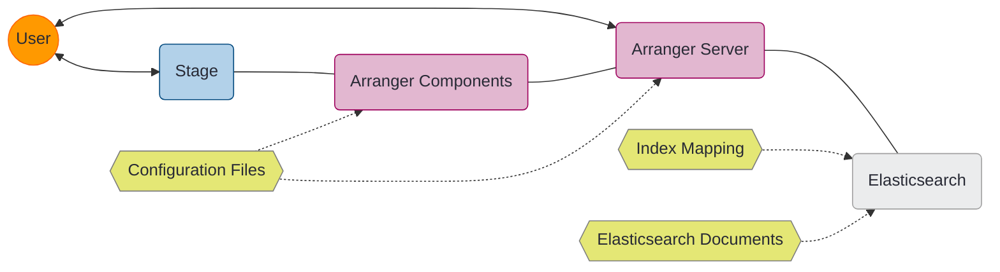
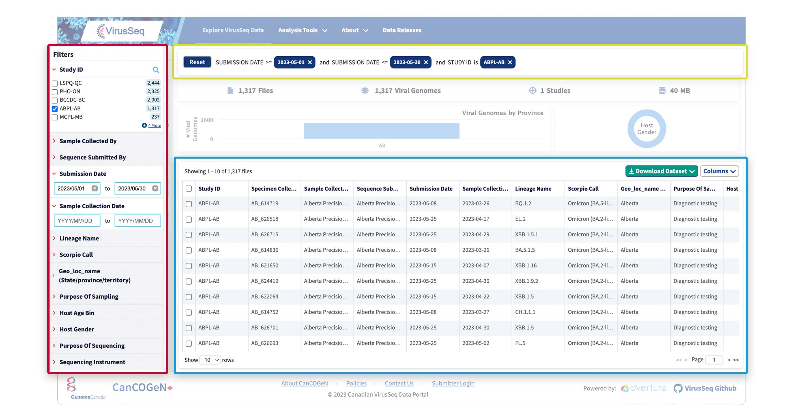

# Overview

[Arranger](https://github.com/overture-stack/arranger) is a versatile, data-agnostic search API and UI component library that leverages [Elasticsearch](https://www.elastic.co/guide/en/elasticsearch/reference/current/mapping.html) to generate interactive and highly configurable search components. It's designed to simplify the process of creating powerful search interfaces for complex datasets.

## Key Features 

- **Configurable Search UI:** Arranger provides a suite of customizable search interface components based on Elasticsearch index mappings, These components can be easily customized to fit your specific data structure and user needs without extensive manual coding.
- **GraphQL API:** Arranger Server generates a GraphQL API from your Elasticsearch mappings, this offers:
    - **Efficient Data Retrieval:** Tailor your queries to fetch exactly the data you need.
    - **Adaptable Structure:** The API automatically adjusts to your data structure.
    - **SQON Integration:** Incorporates our custom filter notation for human-readable and machine-processable search queries.
- **Data Agnostic:** Works with any properly structured Elasticsearch index.
- **Integration-Ready:** Designed to work with any react-based front-end UIs.

## System Architecture

Arranger integrates with your underlying Elasticsearch cluster to automatically generate a powerful search API based on your configured index mapping. It consists of two main modules, `Arranger Server` and `Arranger Components`:



**Arranger Server:** 

- Es query cumbersomb, hard to use, specifically from a front end UI friendly
- Arranger puts a graphQL layer on elasticsearch 
    - more like a middleware or intermediatry (interpretive layer between the UI and elasticsearch)
    - talk to arranger please get me this from elasticsearch with a gQL endpoint, 
    - on top of this provides the SQON syntax, this is the interpretation model on top of elasticsearch 
        - Sqons go to arranger, arranger uses them to filter,
            - SQON is language for graphQL filters 
                - additional filter on the response

                can retrieve more specified data from an elasticsearch response though a graphQL query 

**Arranger Components:** A library of React components for building interactive search UIs. Includes faceted search, data tables, and SQON viewers. Communicates with Arranger Server to fetch and display data.



    - **Faceted Search (Red):** Allow users to filter data using multiple dimensions.
    - **Data Tables (Blue):** Display search results in a customizable, interactive table format.
    - **SQON Viewers (Yellow):** Visualize and manage complex search queries.

## Repository Structure

The Arranger repository can be accessed from our Overture-Stack GitHub page [located here](https://github.com/overture-stack/arranger).

```
arranger/
├── docker/
│   ├── elasticsearch/
│   ├── server/
│   ├── test/
│   └── ui/
├── integration-tests/
├── modules/
│   ├── admin-ui/
│   ├── components/
│   └── server/
└── scripts/
```

- **`docker/`**: Contains Docker configurations for various components.
- **`integration-tests/`**: Houses integration tests for system-wide functionality.
- **`modules`/**: Core Arranger modules:
  - **`admin-ui/`**: Administration interface for managing Arranger configurations.
  - **`components/`**: React components for building search UIs.
  - **`server/`**: Arranger Server implementation (GraphQL API).
- **`scripts/`**: Utility scripts for development, deployment, and system management.

