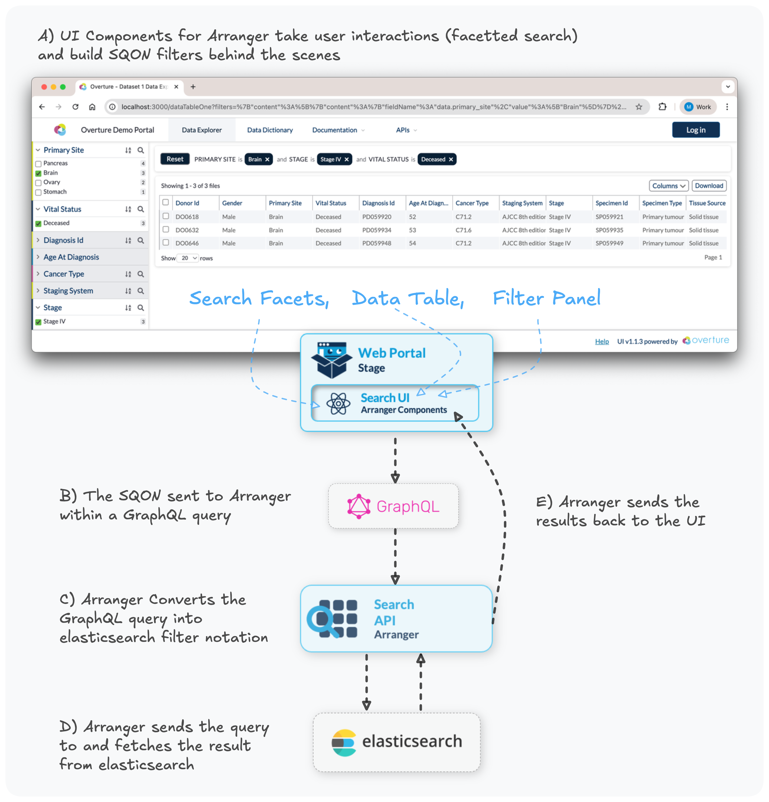

# Query Processing

When a user applies filters in a search interface, the request flows through four main components:

1. **UI Components** translate user interactions into SQON (Serializable Query Object Notation) filter notation
2. **GraphQL** serves as the communication layer, combining SQON filters with field selections, pagination, and sorting parameters
3. **Arranger Server** translates the GraphQL query into an Elasticsearch query
4. **Elasticsearch** executes the query and returns results, which flow back through Arranger to the client

This pipeline separates client-side applications from backend Elasticsearch servers.

:::info **What are SQONs?**
SQON (Serializable Query Object Notation) is Overture's filter language for communicating queries between system components. The examples below show SQONs in action, followed by detailed explanations of [what SQON is](#sqon-the-filter-language), [why it exists](#why-sqon-exists), and [how to build them](#understanding-sqon-structure).
:::

## The Processing Flow

The following example demonstrates the query proecessing pipeline:



<details>
<summary><b>A) View the SQON generated by the UI</b></summary>

```json showLineNumbers
{
  "op": "and",
  "content": [
    {
      "op": "in",
      "content": {
        "fieldName": "data.primary_site",
        "value": ["Brain"]
      }
    },
    {
      "op": "in",
      "content": {
        "fieldName": "data.stage",
        "value": ["Stage IV"]
      }
    },
    {
      "op": "in",
      "content": {
        "fieldName": "data.vital_status",
        "value": ["Deceased"]
      }
    }
  ]
}
```

This SQON filters for records where:
- Primary site is "Brain" **AND**
- Stage is "Stage IV" **AND**
- Vital status is "Deceased"

</details>

The client sends the SQON to Arranger as part of a GraphQL request:

<details>
<summary><b>B) View the GraphQL query with embedded SQON</b></summary>

```json showLineNumbers
{
  "query": "query tableData($sqon: JSON, ...) {
    file { // Arranger's "document type"
      hits(filters: $sqon, ...) { ... }
    }
  }",
  "variables": {
    "sqon": {
      "op": "and",
      "content": [
        {
          "op": "in",
          "content": {
            "fieldName": "data.primary_site",
            "value": ["Brain"]
          }
        },
        {
          "op": "in",
          "content": {
            "fieldName": "data.stage",
            "value": ["Stage IV"]
          }
        },
        {
          "op": "in",
          "content": {
            "fieldName": "data.vital_status",
            "value": ["Deceased"]
          }
        }
      ]
    },
    "first": 20,
    "offset": 0,
    "sort": []
  }
}
```

**Key Components:**

- **SQON Filter** (lines 4-29): The filter logic passed as a query variable
- **`filters: $sqon`** (line 2): The GraphQL query parameter that receives the filter
- **Pagination** (lines 24-25): `first` and `offset` control how many records to fetch and where to start
- **Sorting** (line 26): Order of results (empty in this example)

</details>

Arranger receives the GraphQL request and translates the entire query, including the embedded SQON filter, into a native Elasticsearch query:

<details>
<summary><b>C) View the resulting Elasticsearch query</b></summary>

```json showLineNumbers
{
  "query": {
    "bool": {
      "must": [
        {
          "terms": {
            "data.primary_site": ["Brain"]
          }
        },
        {
          "terms": {
            "data.stage": ["Stage IV"]
          }
        },
        {
          "terms": {
            "data.vital_status": ["Deceased"]
          }
        }
      ]
    }
  },
  "from": 0,
  "size": 20,
  "sort": []
}
```

**Translation Breakdown:**

| SQON Component | Elasticsearch Equivalent | Notes |
|----------------|-------------------------|-------|
| `"op": "and"` | `"bool": { "must": [...] }` | AND logic requires all conditions to match |
| `"op": "in"` | `"terms": { "field": [...] }` | IN operation uses Elasticsearch's `terms` query |
| `"fieldName": "data.primary_site"` | `"data.primary_site": [...]` | Field name maps directly to the index mapping |
| `"first": 20` | `"size": 20` | Pagination size parameter |
| `"offset": 0` | `"from": 0` | Pagination offset parameter |

:::tip
This translation happens automatically ensuring users never need to interact directly with Elasticsearch.
:::

</details>

## SQON: The Filter Language

**SQON** (pronounced like "scone") is Overture's custom filter syntax that provides a simple notation for expressing boolean filter logic. In Arranger, SQONs are embedded in GraphQL queries and automatically translated into Elasticsearch queries by the server.

### Why SQON Exists

SQON solves a fundamental challenge in data applications: **how to define and communicate filters between different parts of a system**.

Traditional approaches use flat lists of filters, which are simple but limited. SQON provides a more powerful solution by supporting **nested boolean logic** (combining AND, OR, and NOT operations) while remaining easy to work with.

<details>
<summary><b>Example: Flat Filter vs. SQON</b></summary>

**Flat Filter Approach:**

A typical flat filter uses simple key-value pairs with implicit AND logic:

```json
{
  "province": "Ontario",
  "age": "20-29"
}
```

**Limitations:**
- Can only express AND logic (all conditions must match)
- Cannot express OR relationships between filters
- Cannot nest conditions or create complex boolean expressions

**SQON Approach:**

SQON can express the same filter explicitly:

```json
{
  "op": "and",
  "content": [
    {
      "op": "in",
      "content": {
        "fieldName": "province",
        "value": ["Ontario"]
      }
    },
    {
      "op": "in",
      "content": {
        "fieldName": "age",
        "value": ["20-29"]
      }
    }
  ]
}
```

**Where SQON Excels - Complex Logic:**

Find records where location is **(Ontario OR Quebec OR United States) AND age is (20-29 OR 30-39)**

Flat filters cannot express this, however, SQON can:

```json
{
  "op": "and",
  "content": [
    {
      "op": "or",
      "content": [
        {
          "op": "in",
          "content": {
            "fieldName": "province",
            "value": ["Ontario", "Quebec"]
          }
        },
        {
          "op": "in",
          "content": {
            "fieldName": "country",
            "value": ["United States"]
          }
        }
      ]
    },
    {
      "op": "in",
      "content": {
        "fieldName": "age",
        "value": ["20-29", "30-39"]
      }
    }
  ]
}
```

</details>

**Key Benefits:**

1. **Serialization** - SQONs can be flattened into URLs, stored, or transmitted between services
2. **Nested Boolean Logic** - Supports complex combinations like "(Ontario OR Quebec) AND (Age 20-29)" that flat filter lists cannot express
3. **Consistency** - Provides a uniform filter notation across different backends, allowing the same SQON syntax to work with Elasticsearch (in Arranger) and PostgreSQL (in Lyric)

This approach separates the concerns of filter definition (SQON) from filter execution (backend-specific queries), making applications more maintainable and portable.

## Understanding SQON Structure

Every SQON is a JSON object built from two types of nested components: **Value Objects** and **Operation Objects**.

Here's a simple SQON that filters for records where the `host_age` is `20-29`:

```json showLineNumbers
{
  "op": "and",
  "content": [
    {
      "op": "in",
      "content": {
        "fieldName": "host_age",
        "value": ["20 - 29"]
      }
    }
  ]
}
```

Let's break down the building blocks:

| Component | Purpose | Required Properties |
|-----------|---------|-------------------|
| **Value Object** | Specifies the field and values to query | `fieldName`, `value` |
| **Operation Object** | Applies logic to value objects | `op`, `content` |

### 1. Value Objects

Value objects define which field to query and what values to match against.

**Example:**

```json
{
  "fieldName": "host_age",
  "value": ["20 - 29"]
}
```

**Properties:**

| Property    | Type                  | Description                                                          |
| ----------- | --------------------- | -------------------------------------------------------------------- |
| `fieldName` | `string`              | Name of the field to filter on                          |
| `value`     | `Array<any>` or `any`  | Array of values for `"in"` operations, or scalar for range queries (`>=`, `<=`) |

:::tip
Value objects are always wrapped by an operation object—they never appear at the top level of a SQON.
:::

### 2. Operation Objects

Operation objects come in two types:

#### 1. Field Operations

Field operations specify **how to match** field values.

**Example:**

```json
{
  "op": "in",
  "content": {
    "fieldName": "host_age",
    "value": ["20 - 29"]
  }
}
```

**Available Field Operations:**

| Operator | Description                                      | Value Type         | Example |
| -------- | ------------------------------------------------ | ------------------ | ------- |
| `"in"`   | Field value must match one of the listed values  | Array              | `"value": ["Ontario", "Quebec"]` |
| `">="`   | Field value must be greater than or equal to     | Scalar (number)    | `"value": 1640926800000` |
| `"<="`   | Field value must be less than or equal to        | Scalar (number)    | `"value": 1672549199999` |

#### 2. Combination Operations

Combination operations group multiple operations together using boolean logic.

**Example:**

```json
{
  "op": "and",
  "content": [
    { /* field operation 1 */ },
    { /* field operation 2 */ }
  ]
}
```

**Available Combinators:**

| Operator | Logic | Description |
| -------- | ----- | ----------- |
| `"and"`  | ALL must be true | Every operation in the `content` array must match |
| `"or"`   | ANY can be true | At least one operation in the `content` array must match |
| `"not"`  | NONE can be true | Inverts the result of the operation(s) in `content` |

**Properties:**

| Property  | Type                      | Description                                           |
| --------- | ------------------------- | ----------------------------------------------------- |
| `op`      | `string`                  | Boolean operation: `"and"`, `"or"`, or `"not"` |
| `content` | `Array<OperationObject>`  | List of field operations or nested combination operations |

:::warning **Important Rule**
The top level of every SQON must be a combination operation, even if you're only applying a single filter.
:::

## Complete SQON Examples

### Example 1: Multiple AND Conditions

All filters applied in the faceted search panel are displayed in the SQON viewer:


The selection of filters shown above is recorded in SQON format as follows:

```json showLineNumbers
{
  "op": "and",
  "content": [
    {
      "op": "in",
      "content": {
        "fieldName": "experiment.sequencing_instrument",
        "value": ["Illumina NextSeq 550"]
      }
    },
    {
      "op": ">=",
      "content": {
        "fieldName": "first_published_at",
        "value": 1640926800000
      }
    },
    {
      "op": "<=",
      "content": {
        "fieldName": "first_published_at",
        "value": 1672549199999
      }
    },
    {
      "op": "in",
      "content": {
        "fieldName": "host_age",
        "value": ["20 - 29"]
      }
    },
    {
      "op": "in",
      "content": {
        "fieldName": "sample_collection.geo_loc_province",
        "value": ["Ontario"]
      }
    }
  ]
}
```

**What this means:**

This SQON filters for records where:
- Sequencing instrument is "Illumina NextSeq 550" **AND**
- First published date is between December 31, 2021 and December 31, 2022 **AND**
- Host age is in the 20-29 range **AND**
- Sample collection province is Ontario

  :::info
  All date values are represented as [Unix timestamps](https://www.unixtimestamp.com/).
  :::

### Example 2: Nested Logic (AND with OR)

You can create sophisticated filters by nesting combination operations:

```json showLineNumbers
{
  "op": "and",
  "content": [
    {
      "op": "or",
      "content": [
        {
          "op": "in",
          "content": {
            "fieldName": "sample_collection.geo_loc_province",
            "value": ["Ontario", "Quebec"]
          }
        },
        {
          "op": "in",
          "content": {
            "fieldName": "sample_collection.geo_loc_country",
            "value": ["United States"]
          }
        }
      ]
    },
    {
      "op": "in",
      "content": {
        "fieldName": "host_age",
        "value": ["20 - 29", "30 - 39"]
      }
    }
  ]
}
```

:::info **What this means:**
This SQON filters for records where:
- (Province is Ontario **OR** Quebec **OR** Country is United States) **AND**
- Age is between 20-39 years old

This demonstrates how you can combine OR logic for location with AND logic for age restrictions.
:::

:::info **Need Help?**
If you encounter any issues or have questions, please don't hesitate to reach out through our relevant [**community support channels**](https://docs.overture.bio/community/support).
:::
