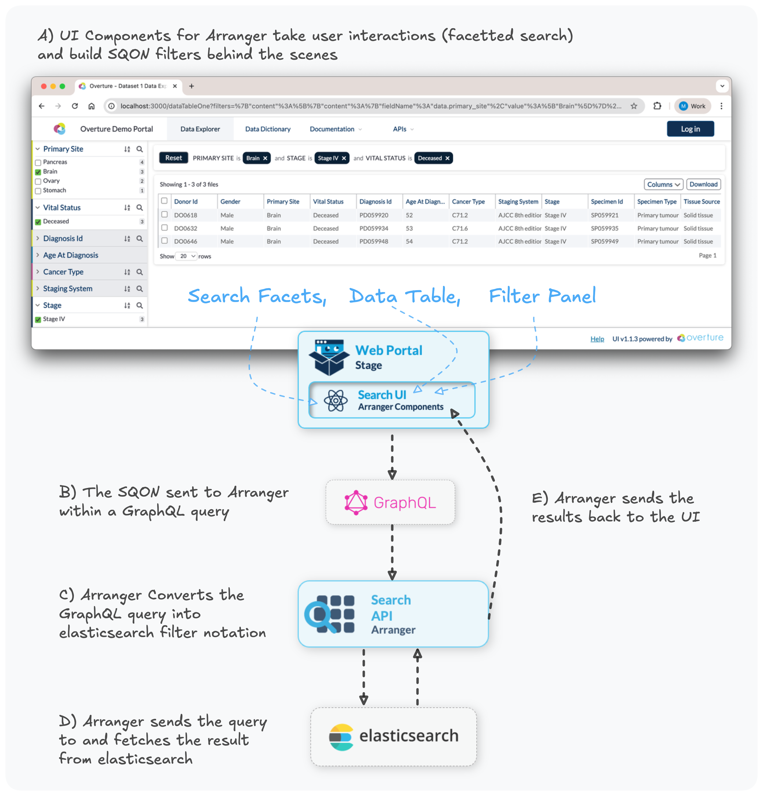

# Query Processing

When a user applies filters in a search interface, the request flows through four main components:

1. **UI Components** translate user interactions into SQON (Serializable Query Object Notation) filters
2. **GraphQL** serves as the communication layer, combining SQON filters with field selections, pagination, and sorting parameters
3. **Arranger Server** translates the GraphQL query into an Elasticsearch query
4. **Elasticsearch** executes the query and returns results, which flow back through Arranger to the client

This pipeline separates client-side applications from backend Elasticsearch servers.

:::info **What are SQONs?**
SQON (Serializable Query Object Notation) is Overture's filter language for communicating queries between system components. The examples below show SQONs in action, followed by detailed explanations of [what SQON is](#sqon-at-a-glance), [why it exists](#why-sqon-exists). For a deeper reference on how to build them using operators, aliases, pivots, and covering common edge cases, see [SQON in detail](./04-sqon-in-detail.md).
:::

## The Processing Flow

The following example demonstrates the query processing pipeline:



<details>
<summary><b>A) View the SQON generated by the UI</b></summary>

```json showLineNumbers
{
	"op": "and",
	"content": [
		{
			"op": "in",
			"content": {
				"fieldName": "data.primary_site",
				"value": ["Brain"]
			}
		},
		{
			"op": "in",
			"content": {
				"fieldName": "data.stage",
				"value": ["Stage IV"]
			}
		},
		{
			"op": "in",
			"content": {
				"fieldName": "data.vital_status",
				"value": ["Deceased"]
			}
		}
	]
}
```

This SQON filters for records where:

- Primary site is "Brain" **AND**
- Stage is "Stage IV" **AND**
- Vital status is "Deceased"

</details>

The client sends the SQON to Arranger as part of a GraphQL request:

<details>
<summary><b>B) View the GraphQL query with embedded SQON</b></summary>

```json showLineNumbers
{
  "query": "query tableData($sqon: JSON, ...) {
    file { // Arranger's "document type"
      hits(filters: $sqon, ...) { ... }
    }
  }",
  "variables": {
    "sqon": {
      "op": "and",
      "content": [
        {
          "op": "in",
          "content": {
            "fieldName": "data.primary_site",
            "value": ["Brain"]
          }
        },
        {
          "op": "in",
          "content": {
            "fieldName": "data.stage",
            "value": ["Stage IV"]
          }
        },
        {
          "op": "in",
          "content": {
            "fieldName": "data.vital_status",
            "value": ["Deceased"]
          }
        }
      ]
    },
    "first": 20,
    "offset": 0,
    "sort": []
  }
}
```

**Key Components:**

- **SQON Filter** (lines 4-29): The filter logic passed as a query variable
- **`filters: $sqon`** (line 2): The GraphQL query parameter that receives the filter
- **Pagination** (lines 24-25): `first` and `offset` control how many records to fetch and where to start
- **Sorting** (line 26): Order of results (empty in this example)

:::tip
This example sets `first: 20` explicitly. If `first` is omitted entirely, it defaults to 10, along with a number of other non-obvious defaults for aggregations and downloads; see [Defaults and Limits](./07-defaults-and-limits.md) for the full list.
:::

</details>

Arranger receives the GraphQL request and translates the entire query, including the embedded SQON filter, into a native Elasticsearch query:

<details>
<summary><b>C) View the resulting Elasticsearch query</b></summary>

```json showLineNumbers
{
	"query": {
		"bool": {
			"must": [
				{
					"terms": {
						"data.primary_site": ["Brain"]
					}
				},
				{
					"terms": {
						"data.stage": ["Stage IV"]
					}
				},
				{
					"terms": {
						"data.vital_status": ["Deceased"]
					}
				}
			]
		}
	},
	"from": 0,
	"size": 20,
	"sort": []
}
```

**Translation Breakdown:**

| SQON Component                     | Elasticsearch Equivalent      | Notes                                           |
| ---------------------------------- | ----------------------------- | ----------------------------------------------- |
| `"op": "and"`                      | `"bool": { "must": [...] }`   | AND logic requires all conditions to match      |
| `"op": "in"`                       | `"terms": { "field": [...] }` | IN operation uses Elasticsearch's `terms` query |
| `"fieldName": "data.primary_site"` | `"data.primary_site": [...]`  | Field name maps directly to the index mapping   |
| `"first": 20`                      | `"size": 20`                  | Pagination size parameter                       |
| `"offset": 0`                      | `"from": 0`                   | Pagination offset parameter                     |

:::tip
This translation happens automatically ensuring users never need to interact directly with Elasticsearch.
:::

</details>

## SQON At A Glance

**SQON** (pronounced like "scone") is Overture's JSON-based filter syntax.

At a high level:

- a SQON is made of **operations**
- those operations can be **leaf filters** or **boolean groups**
- in Arranger, the SQON is sent as part of a GraphQL request
- which in turn is translated into an Elasticsearch query

<details>
<summary><b>Here is a small example:</b></summary>

```json
{
	"op": "and",
	"content": [
		{
			"op": "in",
			"content": {
				"fieldName": "province",
				"value": ["Ontario"]
			}
		},
		{
			"op": "gte",
			"content": {
				"fieldName": "age",
				"value": 18
			}
		}
	]
}
```

This means:

- province is Ontario
- and age is at least 18

</details>

### Why SQON exists:

SQON solves a fundamental challenge in data applications: **how to define and communicate filters between different parts of a system**. Traditional approaches use flat lists of filters, which are simple but limited. SQON provides a more powerful solution by supporting **nested boolean logic** (combining AND, OR, and NOT operations) while remaining easy to work with.

1. **Serialization**: SQONs can be stored, transmitted, or encoded into URLs
2. **Nested boolean logic**: SQONs can express combinations that flat filters cannot
3. **Separation of concerns**: clients define filters once, while Arranger handles backend-specific query translation

:::tip
If you want the full SQON reference, including operators, aliases, pivot behavior, accepted value shapes, and edge cases, continue to [SQONs in detail](./04-sqon-in-detail.md).
:::

:::info **Need Help?**
If you encounter any issues or have questions, please don't hesitate to reach out through our relevant [**community support channels**](https://docs.overture.bio/community/support).
:::
