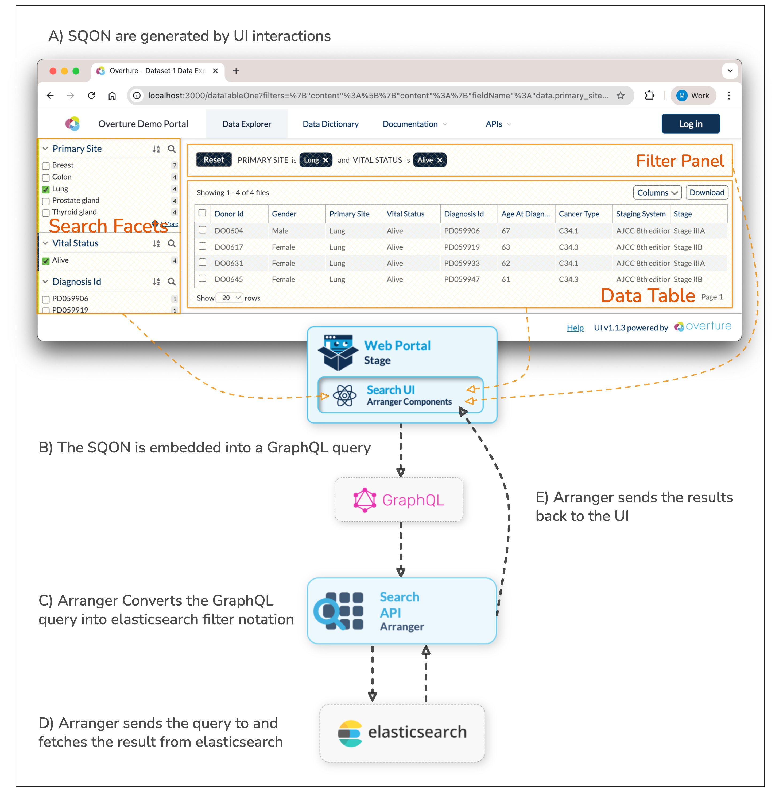

# Serializable Query Object Notation

**SQON** (pronounced like "scone") is a custom filter syntax that provides a simplified, human-readable notation for expressing filter logic. SQONs are embedded within GraphQL queries and translated into Elasticsearch query syntax.

### Why SQON Exists

Overture platforms use Elasticsearch to efficiently search through massive datasets. While Elasticsearch is powerful, its native query syntax is too complex for client-side search UIs. SQON provides a simplified filter notation that:
- UI components can easily generate from user interactions
- Humans and developers can visually parse and understand
- Arranger (our Search API) can translate into valid Elasticsearch queries
- Can be serialized and embedded into URLs, enabling shareable links to pre-filtered views

### How SQON Works

SQONs benefit three key components in the Overture architecture:

1. **UI Components** generate SQONs by translating user interactions into SQON filter syntax
2. **GraphQL** serves as the communication layer, allowing clients to send queries that combine SQON filters alongside field selections, pagination, and sorting parameters
3. **Arranger** (the Search API server) acts as the interpretation layer, converting GraphQL queries (with embedded SQON) into the complex Elasticsearch queries needed to fetch results



When a user applies filters in the UI, the client-side components translate those selections into SQON format:

<details>
<summary><b>A) View the SQON generated by the UI</b></summary>

```json showLineNumbers
{
  "op": "and",
  "content": [
    {
      "op": "in",
      "content": {
        "fieldName": "data.primary_site",
        "value": ["Lung"]
      }
    },
    {
      "op": "in",
      "content": {
        "fieldName": "data.vital_status",
        "value": ["Alive"]
      }
    }
  ]
}
```

This SQON filters for records where:
- Primary site is "Lung" **AND**
- Vital status is "Alive"

</details>

The client sends the SQON to Arranger as part of a GraphQL request:

<details>
<summary><b>B) View the GraphQL query with embedded SQON</b></summary>

```json showLineNumbers
{
  "query": "query tableData($sqon: JSON, ...) { file { hits(filters: $sqon, ...) { ... } } }",
  "variables": {
    "sqon": {
      "op": "and",
      "content": [
        {
          "op": "in",
          "content": {
            "fieldName": "data.primary_site",
            "value": ["Lung"]
          }
        },
        {
          "op": "in",
          "content": {
            "fieldName": "data.vital_status",
            "value": ["Alive"]
          }
        }
      ]
    },
    "first": 20,
    "offset": 0,
    "sort": []
  }
}
```

**Key Components:**

- **SQON Filter** (lines 4-23): The filter logic passed as a query variable
- **`filters: $sqon`** (line 2): The GraphQL query parameter that receives the filter
- **Pagination** (lines 24-25): `first` and `offset` control how many records to fetch and where to start
- **Sorting** (line 26): Order of results (empty in this example)

</details>

Arranger receives the GraphQL request and translates the entire query, including the embedded SQON filter, into a native Elasticsearch query:

<details>
<summary><b>C) View the resulting Elasticsearch query</b></summary>

```json showLineNumbers
{
  "query": {
    "bool": {
      "must": [
        {
          "terms": {
            "data.primary_site": ["Lung"]
          }
        },
        {
          "terms": {
            "data.vital_status": ["Alive"]
          }
        }
      ]
    }
  },
  "from": 0,
  "size": 20,
  "sort": []
}
```

**Translation Breakdown:**

| SQON Component | Elasticsearch Equivalent | Notes |
|----------------|-------------------------|-------|
| `"op": "and"` | `"bool": { "must": [...] }` | AND logic requires all conditions to match |
| `"op": "in"` | `"terms": { "field": [...] }` | IN operation uses Elasticsearch's `terms` query |
| `"fieldName": "data.primary_site"` | `"data.primary_site": [...]` | Field name maps directly to the index mapping |
| `"first": 20` | `"size": 20` | Pagination size parameter |
| `"offset": 0` | `"from": 0` | Pagination offset parameter |

:::tip
This translation happens automatically—users and UI developers never need to write Elasticsearch queries directly. They only work with the simpler SQON syntax.
:::

</details>

## Understanding SQON Structure

Every SQON is a JSON object built from two types of nested components: **Value Objects** and **Operation Objects**.

Here's a simple SQON that filters for records where the `host_age` is `20-29`:

```json showLineNumbers
{
  "op": "and",
  "content": [
    {
      "op": "in",
      "content": {
        "fieldName": "host_age",
        "value": ["20 - 29"]
      }
    }
  ]
}
```

Let's break down the building blocks:

| Component | Purpose | Required Properties |
|-----------|---------|-------------------|
| **Value Object** | Specifies the field and values to query | `fieldName`, `value` |
| **Operation Object** | Applies logic to value objects | `op`, `content` |

### 1. Value Objects

Value objects define which field to query and what values to match against.

**Example:**

```json
{
  "fieldName": "host_age",
  "value": ["20 - 29"]
}
```

**Properties:**

| Property    | Type                  | Description                                                          |
| ----------- | --------------------- | -------------------------------------------------------------------- |
| `fieldName` | `string`              | Name of the field to filter on                          |
| `value`     | `Array<any>` or `any`  | Array of values for `"in"` operations, or scalar for range queries (`>=`, `<=`) |

:::tip
Value objects are always wrapped by an operation object—they never appear at the top level of a SQON.
:::

### 2. Operation Objects

Operation objects come in two types:

#### 1. Field Operations

Field operations specify **how to match** field values.

**Example:**

```json
{
  "op": "in",
  "content": {
    "fieldName": "host_age",
    "value": ["20 - 29"]
  }
}
```

**Available Field Operations:**

| Operator | Description                                      | Value Type         | Example |
| -------- | ------------------------------------------------ | ------------------ | ------- |
| `"in"`   | Field value must match one of the listed values  | Array              | `"value": ["Ontario", "Quebec"]` |
| `">="`   | Field value must be greater than or equal to     | Scalar (number)    | `"value": 1640926800000` |
| `"<="`   | Field value must be less than or equal to        | Scalar (number)    | `"value": 1672549199999` |

#### 2. Combination Operations

Combination operations group multiple operations together using boolean logic.

**Example:**

```json
{
  "op": "and",
  "content": [
    { /* field operation 1 */ },
    { /* field operation 2 */ }
  ]
}
```

**Available Combinators:**

| Operator | Logic | Description |
| -------- | ----- | ----------- |
| `"and"`  | ALL must be true | Every operation in the `content` array must match |
| `"or"`   | ANY can be true | At least one operation in the `content` array must match |
| `"not"`  | NONE can be true | Inverts the result of the operation(s) in `content` |

**Properties:**

| Property  | Type                      | Description                                           |
| --------- | ------------------------- | ----------------------------------------------------- |
| `op`      | `string`                  | Boolean operation: `"and"`, `"or"`, or `"not"` |
| `content` | `Array<OperationObject>`  | List of field operations or nested combination operations |

:::warning **Important Rule**
The top level of every SQON must be a combination operation, even if you're only applying a single filter.
:::

## Complete SQON Examples

### Example 1: Multiple AND Conditions

All filters applied in the faceted search panel are displayed in the SQON viewer:


The selection of filters shown above is recorded in SQON format as follows:

```json showLineNumbers
{
  "op": "and",
  "content": [
    {
      "op": "in",
      "content": {
        "fieldName": "experiment.sequencing_instrument",
        "value": ["Illumina NextSeq 550"]
      }
    },
    {
      "op": ">=",
      "content": {
        "fieldName": "first_published_at",
        "value": 1640926800000
      }
    },
    {
      "op": "<=",
      "content": {
        "fieldName": "first_published_at",
        "value": 1672549199999
      }
    },
    {
      "op": "in",
      "content": {
        "fieldName": "host_age",
        "value": ["20 - 29"]
      }
    },
    {
      "op": "in",
      "content": {
        "fieldName": "sample_collection.geo_loc_province",
        "value": ["Ontario"]
      }
    }
  ]
}
```

**What this means:**

This SQON filters for records where:
- Sequencing instrument is "Illumina NextSeq 550" **AND**
- First published date is between December 31, 2021 and December 31, 2022 **AND**
- Host age is in the 20-29 range **AND**
- Sample collection province is Ontario

:::info
All date values are represented as [Unix timestamps](https://www.unixtimestamp.com/).
:::

### Example 2: Nested Logic (AND with OR)

You can create sophisticated filters by nesting combination operations:

```json showLineNumbers
{
  "op": "and",
  "content": [
    {
      "op": "or",
      "content": [
        {
          "op": "in",
          "content": {
            "fieldName": "sample_collection.geo_loc_province",
            "value": ["Ontario", "Quebec"]
          }
        },
        {
          "op": "in",
          "content": {
            "fieldName": "sample_collection.geo_loc_country",
            "value": ["United States"]
          }
        }
      ]
    },
    {
      "op": "in",
      "content": {
        "fieldName": "host_age",
        "value": ["20 - 29", "30 - 39"]
      }
    }
  ]
}
```

:::info **What this means:**
This SQON filters for records where:
- (Province is Ontario **OR** Quebec **OR** Country is United States) **AND**
- Age is between 20-39 years old

This demonstrates how you can combine OR logic for location with AND logic for age restrictions.
:::

:::info **Need Help?**
If you encounter any issues or have questions, please don't hesitate to reach out through our relevant [**community support channels**](https://docs.overture.bio/community/support).
:::
