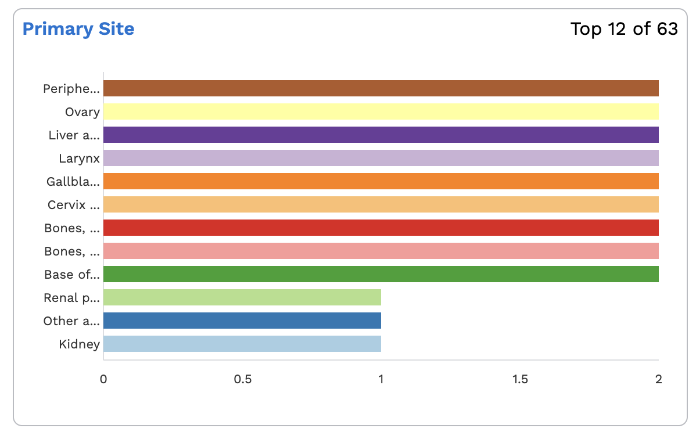
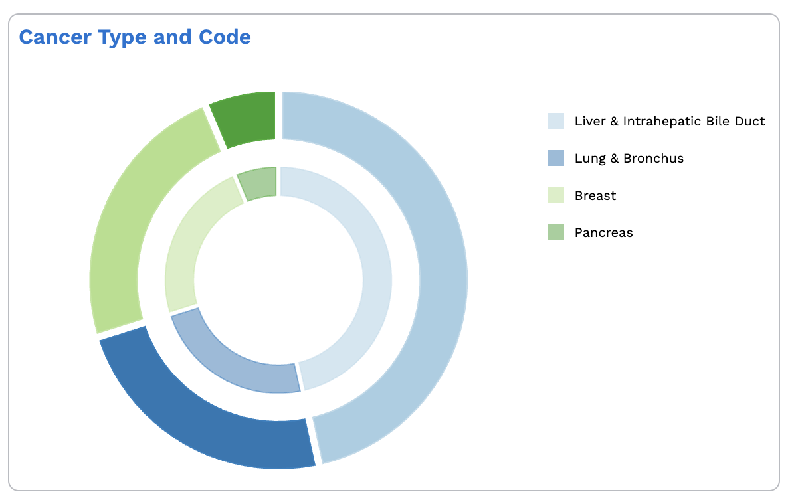

# Arranger Charts - Maintainer Documentation

## Overview

Arranger Charts provides React components for data visualizations with separated data management and visual presentation. The library offers:

- **Reusable Components**: Standardized chart components for Overture applications
- **Flexible Views**: Abstract charting implementation supports switching between libraries (currently Nivo, designed for D3 or other engines)

Charts integrate with Arranger's GQL ecosystem and validate fields against extended mapping configurations. The provider-based context coordinates multiple visualizations in a single API call.

---

## Consumer Examples

### Basic Setup

Wrap applications in required providers:

```tsx
<ArrangerDataProvider>
	<ChartsProvider
		debugMode={false}
		loadingDelay={300}
	>
		<ChartsThemeProvider colors={customColors}>
			<BarChart
				fieldName="study_id"
				maxBars={10}
				handlers={{ onClick: handleClick }}
			/>
		</ChartsThemeProvider>
	</ChartsProvider>
</ArrangerDataProvider>
```

### Multiple Charts

```jsx
<ChartsThemeProvider
	colors={['#a6cee3', '#1f78b4', '#b2df8a']}
	components={{
		EmptyData: CustomEmptyComponent,
		Loader: CustomLoader,
	}}
>
	<BarChart
		fieldName="primary_diagnosis__age_at_diagnosis"
		maxBars={5}
		ranges={[
			{ key: '< 18', to: 18 },
			{ key: '18 - 65', from: 18, to: 66 },
			{ key: '> 65', from: 66 },
		]}
		theme={{ sortByKey: ['__missing__', '> 65', '18 - 65', '< 18'] }}
	/>

	<SunburstChart
		fieldName="primary_diagnosis__cancer_type_code"
		mapper={mapperFn}
		maxSegments={5}
		handlers={{ onClick: handleSunburstClick }}
	/>
</ChartsThemeProvider>
```

---

### Architecture

Each chart follows this data flow:

1. **Registration**: Components register with `ChartsProvider` on mount
2. **Validation**: Check required props and field compatibility
3. **Query Building**: Construct dynamic GQL queries from all registered charts
4. **API Call**: Single request fetches data for all charts
5. **Transformation**: Transform GQL responses to chart-ready structures
6. **Rendering**: `ChartRenderer` displays loading, error, empty, or chart states
7. **Visualization**: Chart views handle rendering with persistent theming

### Component Hierarchy

```
ChartsProvider (data management)
└── ChartsThemeProvider (theming)
    ├── BarChart (consumer interface)
    │   ├── ChartRenderer (state routing)
    │   └── BarChartView (visualization)
    └── SunburstChart (consumer interface)
        ├── ChartRenderer (state routing)
        └── SunburstView (visualization)
```

---

### Registration System

Charts register with validated configuration:

```tsx
const validationResult = validateQueryProps({ fieldName, variables, extendedMapping });
registerChart(validationResult.data);
```

Charts can nest anywhere without prop drilling.

### Query Building

`useDynamicQuery` constructs single GQL queries from registered charts:

```tsx
const gqlQuery = useMemo(() => {
	return generateChartsQuery({ documentType, queryFields });
}, [documentType, queryFields]);
```

### API Management

`useNetworkQuery` handles requests:

```tsx
const { apiState } = useNetworkQuery({
	query,
	apiFetcher,
	sqon,
	loadingDelay,
});
```

Uses Arranger's `apiFetcher` for authenticated requests. Optional `loadingDelay` prevents loading flashes.

### Data Transformation

Standardize GQL responses:

```tsx
const buckets = gqlBuckets.map(({ key, doc_count }) => ({
	key: key,
	label: key === '__missing__' ? 'No Data' : key,
	value: doc_count,
}));
```

### Validation

Ensures chart type safety:

- **Field Type**: Confirms GQL field types match aggregation types

---

### ChartRenderer Pattern

State-based rendering:

```tsx
if (isLoading) return <LoaderComponent />;
if (isError) return <ErrorComponent />;
if (isEmpty) return <EmptyComponent />;
return <Chart />;
```

Override default components:

```tsx
<ChartsThemeProvider
	components={{
		Loader: CustomLoadingSpinner,
		ErrorData: CustomErrorMessage,
		EmptyData: CustomEmptyState,
	}}
/>
```

### Nivo Integration

Transform configurations:

```tsx
const resolvedTheme = arrangerToNivoBarChart({
	theme,
	colorMap,
	onClick: handlers?.onClick,
});
```

---

### Theming System

## Color Persistence

`useColorMap` maintains consistent colors:

```tsx
const { colorMap } = useColorMap({
	colorMapRef,
	chartData,
	resolver,
});
```

Ensures:

- Consistent colors across re-renders
- Same data keys receive same colors
- Color assignments persist when data order changes

## Custom Colors

Provide palettes through `ChartsThemeProvider`:

```tsx
<ChartsThemeProvider colors={['#a6cee3', '#1f78b4', '#b2df8a']}>
```

Colors loop when dataset exceeds array length.

---

### Context Providers

### ChartsProvider

Manages chart state and data:

**Methods:**

- `registerChart(queryProps)`: Adds chart to query
- `deregisterChart(fieldName)`: Removes chart from query
- `getChartData(fieldName)`: Returns API state for field

### ChartsThemeProvider

Manages visual consistency:

**Options:**

- `colors`: Hex color array for chart elements
- `components`: Custom components for loading, error, empty states

### ArrangerDataProvider

External dependency providing:

- `documentType`: Root GQL document type
- `apiFetcher`: API client function
- `sqon`: Current filter state
- `extendedMapping`: Field configuration for validation

---

### BarChart Component



## Interface

```tsx
<BarChart
	fieldName="study_id" // Required: GQL field name
	maxBars={10} // Required: Display limit
	ranges={[
		// Optional: For numeric fields
		{ key: '< 18', to: 18 },
		{ key: '18 - 65', from: 18, to: 66 },
		{ key: '> 65', from: 66 },
	]}
	handlers={{ onClick: fn }} // Optional: Event handlers
	theme={{
		// Optional: Visual customizations
		sortByKey: ['__missing__', 'Other', 'Female', 'Male'],
	}}
/>
```

## Flow

1. **Validation**: Throws error if `maxBars` missing
2. **Field Checking**: Validates against Arranger mapping
3. **Type Validation**:
    - `Aggregations`: `ranges` is invalid
    - `NumericAggregations`: `ranges` is required
4. **Registration**: Adds to ChartsProvider

## View Rendering

BarChartView handles:

- **Sorting**: Default ascending by value, custom via `theme.sortByKey`
- **Colors**: Persistent mapping via `colorMapRef`
- **Limiting**: Truncates to `maxBars` after sorting
- **Integration**: Transforms for Nivo ResponsiveBar

## Events

Click/hover events provide bar object with `label` and `value`.

---

### SunburstChart Component



## Interface

<SunburstChart
fieldName="primary_diagnosis\_\_cancer_type_code" // Required
mapping={mappingFn} // Required: Child to parent mapping
handlers={{ onClick: fn }} // Optional
/>

Uses two positioned pie charts due to Nivo sunburst styling constraints.

## Flow

1. **Validation**: Throws error if `mapping` or `maxSegments` are missing
2. **Field Checking**: Validates against Arranger mapping
3. **Registration**: Adds to ChartsProvider

## View Rendering

- **Grouping**: Groups child codes by parent categories using `mapping`
- **Aggregation**: Sums child values for parent totals
- **Structure**: Builds inner/outer rings
- **Limiting**: Truncates to `maxSegments`
- **Legend**: Creates color-related entries

## Architecture

Overlapping ResponsivePie components:

- **Outer Ring**: Full-size pie with specific categories
- **Inner Ring**: Centered pie with parent categories

## Colors

Inner ring uses alpha transparency, outer ring uses full opacity:

```tsx
colorMap.set(parentId, color.alpha(0.5).hsl().string());
children.forEach((child) => {
	colorMap.set(child, color.string());
});
```

## Events

Click and hover events provide object with `label` and `value`.

---

### Contributing Guidelines

When extending the library:

1. **Separate Concerns**: Keep data layer and view layer separate
2. **Validate**: Reuse and implement validation for new chart types
3. **Persist Colors**: Use `useColorMap` system for consistent theming
4. **Support Overrides**: Allow state customization via ChartsThemeProvider
